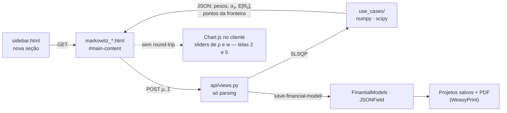

# Plano — Módulo Markowitz no SAETO

Plano de implementação de um módulo didático de **seleção de carteiras por
média-variância** (Markowitz, 1952) no SAETO.

O aplicativo já ensina retorno e volatilidade de *um* ativo. Markowitz é o passo
seguinte natural: o que acontece com o risco quando os ativos são combinados.
Este documento descreve sete telas, um app Django novo e as decisões técnicas
para chegar lá sem quebrar o padrão que já existe.

---

## 1. Ponto de partida — o que já existe e serve de apoio

Markowitz não entra num espaço vazio. Cinco pontos do código atual são
pré-requisito ou gancho direto — vale construir sobre eles em vez de duplicar.

| Onde | O que aproveitar |
| --- | --- |
| `templates/site/teoria/volatilidade.html` | **Retorno e volatilidade de um ativo.** O aluno já digita uma série de preços e obtém retorno discreto, contínuo e volatilidade amostral. É exatamente o insumo do caso multivariado — e a UX de "gerar tabela de períodos" (`generateTable()`) se reaproveita para N ativos. |
| `estocasticos/use_cases/abm_use_case.py` | **O padrão "simulado vs. teórico".** A tabela de estatísticas compara cada momento simulado com o valor analítico exato. O mesmo recurso didático vale para a fronteira: nuvem de carteiras aleatórias contra a fronteira obtida por otimização. |
| `estocasticos/use_cases/comparacao_modelos_use_case.py` | **Tela de comparação de modelos.** Já existe o padrão de uma tela que confronta abordagens no mesmo gráfico. É o molde da tela 6 (sensibilidade e limites do modelo). |
| `financial_options/models.py` · `core/views.py` | **Persistência e relatório prontos.** `FinantialModels` guarda `parameters` e `results` como JSON, gera PDF via WeasyPrint e aparece em "Projetos salvos". Basta acrescentar entradas em `FinantialModelsChoices` — nenhum modelo novo é necessário. |
| `templates/site/teoria/herath_park.html:217`<br>`templates/site/teoria/copeland-antikarov-template.html:205` | **O nome "Markowitz" já aparece — em outro sentido.** As duas telas calculam `markowitzCV`, o coeficiente de variação do VPL (σ/μ), usado como estimador de volatilidade em opções reais. É esperança-variância aplicada a projetos, não seleção de carteiras. |

### 1.1 Achado — rota morta

`teoria_opcao/urls.py:21` registra `markowitz_mean_variance_volatility`, cuja view
(`teoria_opcao/api/views.py:56`) renderiza
`site/teoria/volatility/markowitz_mean_variance.html`. **Esse diretório não existe.**
A rota responde `TemplateDoesNotExist` hoje.

O mesmo vale para os outros templates referenciados pelo mesmo arquivo de views e
igualmente ausentes:

- `site/teoria/volatility/log_cf.html`
- `site/teoria/volatility/brandao_dyer_hahn.html`
- `site/teoria/volatility/var_based.html`
- `site/teoria/volatility/comparison.html`

Nenhuma dessas rotas está no `sidebar.html`, então nenhum aluno chega lá pela
navegação — mas as URLs são públicas e quebram. A **fase 4** fecha esse ponto: são
cinco páginas de conteúdo, não código novo.

### 1.2 Decisão de escopo

"Método de Markowitz" cobre dois assuntos distintos no contexto do SAETO:

1. **Seleção de carteiras por média-variância** (1952) — fronteira eficiente, o
   corpo teórico que falta no aplicativo.
2. **Estimador de volatilidade por coeficiente de variação** — σ = σ<sub>VPL</sub>/μ<sub>VPL</sub>,
   já usado nas telas de opções reais sem ser explicado.

Este plano trata o **primeiro** como módulo principal e usa a fase 4 para dar
página própria ao segundo, ligando os dois explicitamente. *Se a intenção era
apenas o segundo, a fase 4 sozinha resolve.*

---

## 2. Encaixe técnico

O módulo é um app Django novo, `markowitz`, espelhando a estrutura de
`teoria_dos_jogos` e `estocasticos`: `urls.py` magro, `api/views.py` só de parsing
e resposta, e a matemática isolada em `use_cases/`. Os templates continuam sendo
fragmentos sem ``, carregados por AJAX no `#main-content`.

A única extensão ao padrão está nas telas exploratórias: um *slider* de correlação
precisa de resposta imediata, e uma ida ao servidor por movimento do cursor mataria
a intuição que a tela existe para construir. Nessas telas o cálculo acontece no
cliente com Chart.js — já carregado no `home.html`.



O caminho sólido é o padrão que já existe no `estocasticos`, reaproveitado sem
alteração. A **única adição** é o ramo pontilhado.

### 2.1 Estrutura de arquivos nova

```
markowitz/
├── __init__.py  ·  apps.py  ·  urls.py
├── api/views.py                              # parsing + JsonResponse
└── use_cases/
    ├── covariance_estimation_use_case.py     # séries → μ, Σ, ρ (ddof=1)
    ├── two_assets_use_case.py                # curva risco-retorno em ρ
    ├── efficient_frontier_use_case.py        # SLSQP + nuvem Monte Carlo
    ├── capital_market_line_use_case.py       # tangência, Sharpe, CML
    └── frontier_sensitivity_use_case.py      # erro de estimação nos pesos

templates/site/markowitz/                     # 7 fragmentos, sem 
```

Alterações em arquivos existentes:

- `core/settings.py` — `INSTALLED_APPS += "markowitz"`
- `core/urls.py` — `path("markowitz/", include("markowitz.urls"))`
- `templates/site/home/sidebar.html` — nova seção `accordion-6`
- `financial_options/models.py` — três entradas em `FinantialModelsChoices` + migração

---

## 3. A sequência didática — sete telas em ordem

A ordem importa: cada tela usa um resultado da anterior. O aluno chega na
otimização de N ativos só depois de ter visto, com dois ativos e um slider, de onde
vem o ganho da diversificação. A numeração é a ordem de estudo **e** a de
implementação.

### 01 · Visão geral — de um ativo para a carteira

- **Aprende:** que o risco de uma carteira não é a média dos riscos dos seus
  ativos. O problema que Markowitz (1952) formulou e por que ele antecede a
  precificação de opções no currículo.
- **A tela faz:** cartões para as telas 2 a 6, no padrão de `mbg_overview.html`,
  mais um modal "Guia do Módulo" com a teoria em MathJax e a ligação explícita com
  a tela de volatilidade que o aluno já conhece.
- **Arquivo:** `templates/site/markowitz/markowitz_overview.html`

### 02 · Dois ativos e a correlação

- **Aprende:** o núcleo da teoria — o ganho da diversificação *é* a curvatura da
  linha risco-retorno, e ρ é quem a controla. Que existe uma carteira de variância
  mínima com risco menor que o de qualquer um dos dois ativos.
- **A tela faz:** entrada de μ<sub>A</sub>, σ<sub>A</sub>, μ<sub>B</sub>, σ<sub>B</sub>
  e dois sliders — w e ρ ∈ [−1, 1]. O gráfico redesenha a cada movimento, com as
  curvas de ρ = −1, 0 e +1 fixas ao fundo como referência. Cálculo no cliente.
- **Arquivo:** `templates/site/markowitz/two_assets.html`

### 03 · Estimação a partir de séries históricas

- **Aprende:** de onde vêm μ e Σ na prática. Anualização, desvio amostral contra
  populacional, e a leitura de uma matriz de correlação — inclusive que a
  estimativa carrega erro, ponto retomado na tela 6.
- **A tela faz:** tabela de preços para N ativos (reaproveitando o
  `generateTable()` de `volatilidade.html`), devolvendo vetor de retornos, matriz
  de covariância e um mapa de calor de correlação em matplotlib. Usa `ddof=1`,
  como a correção já aplicada na tela de volatilidade.
- **Arquivo:** `markowitz/use_cases/covariance_estimation_use_case.py`

### 04 · Fronteira eficiente com N ativos

- **Aprende:** o que "eficiente" significa — dominância. Por que o ramo inferior
  da fronteira existe e por que nenhum investidor racional o escolhe. O papel da
  restrição de venda a descoberto.
- **A tela faz:** recebe μ e Σ (da tela 3 ou digitados) e devolve as duas coisas
  lado a lado — a nuvem de milhares de carteiras aleatórias e a fronteira
  resolvida por otimização, o mesmo recurso "numérico vs. exato" que as telas de
  MBG já usam. Marca a carteira de variância mínima e tabela os pesos de cada
  ponto.
- **Arquivo:** `markowitz/use_cases/efficient_frontier_use_case.py`

### 05 · Ativo livre de risco, CML e índice de Sharpe

- **Aprende:** a passagem de Markowitz (1952) para Tobin e Sharpe — com um ativo
  livre de risco, a fronteira curva é substituída por uma reta e a escolha se
  separa em duas decisões independentes: qual carteira de risco, e quanto do
  patrimônio nela.
- **A tela faz:** slider de r<sub>f</sub> sobre a fronteira da tela 4, redesenhando
  a reta tangente e recalculando a carteira de tangência e seu Sharpe. Cálculo no
  cliente sobre os pontos já devolvidos pela tela 4.
- **Arquivo:** `markowitz/use_cases/capital_market_line_use_case.py`

### 06 · Limites do modelo — sensibilidade ao erro de estimação

- **Aprende:** a crítica clássica — a otimização média-variância amplifica erro de
  estimativa. Um deslocamento pequeno em μ pode reordenar completamente os pesos
  ótimos. O aluno sai sabendo o que o modelo *não* entrega.
- **A tela faz:** perturba μ em ±x% e mostra a variação nos pesos ótimos lado a
  lado; compara pesos iguais, variância mínima e tangência sob a mesma
  perturbação. Segue o molde de `vizualizacao_modelos.html`.
- **Arquivo:** `markowitz/use_cases/frontier_sensitivity_use_case.py`

### 07 · Ponte com opções reais — a média-variância como estimador de σ

- **Aprende:** que a mesma ideia de esperança-variância reaparece na avaliação de
  projetos como σ = σ<sub>VPL</sub>/μ<sub>VPL</sub>, e por que ali ela mede outra
  coisa. Fecha o vocabulário que as telas de Copeland & Antikarov e Herath & Park
  já usam sem explicar.
- **A tela faz:** preenche a rota quebrada com a página que a view já espera,
  referenciando o `markowitzCV` calculado nas duas telas de opções reais. A mesma
  fase resolve as outras quatro páginas de volatilidade ausentes (§1.1).
- **Arquivo:** `templates/site/teoria/volatility/markowitz_mean_variance.html`

---

## 4. Especificação numérica das telas 2, 4 e 5

Todo o módulo se resolve no plano (σ, E[R]). Os valores abaixo são exatos e servem
como **fixtures de teste** — se a implementação reproduzir esta tabela, a
matemática está certa.

Ativos de referência: **A** (μ = 6%, σ = 12%) e **B** (μ = 14%, σ = 30%);
w = peso em A.

### 4.1 Tela 2 — a família de curvas em ρ

| w | E[R] | σ (ρ = +1) | σ (ρ = 0) | σ (ρ = −1) |
| --: | --: | --: | --: | --: |
| 1,00 | 6,00% | 12,00% | 12,00% | 12,00% |
| 0,90 | 6,80% | 13,80% | **11,21%** | 7,80% |
| 0,80 | 7,60% | 15,60% | **11,32%** | 3,60% |
| 0,70 | 8,40% | 17,40% | 12,31% | 0,60% |
| 0,50 | 10,00% | 21,00% | 16,16% | 9,00% |
| 0,30 | 11,60% | 24,60% | 21,31% | 17,40% |
| 0,00 | 14,00% | 30,00% | 30,00% | 30,00% |

**O que o aluno tem que ver.** Em ρ = +1 a combinação é uma reta e diversificar
não compra nada. Em ρ = 0, as linhas em negrito mostram carteiras com risco
**abaixo dos 12% do ativo A** — risco menor que o de qualquer um dos componentes.
Conforme ρ cai, a linha se curva mais para a esquerda; em ρ = −1 o vértice toca
σ = 0. **Essa é a tese do módulo inteiro**, e é o que o slider de ρ tem que deixar
visível em tempo real.

Carteiras de variância mínima:

| ρ | w* | σ mínimo | E[R] |
| --: | --: | --: | --: |
| 0 | 0,862069 | 11,1417% | 7,1034% |
| −1 | 0,714286 | 0,0000% | 8,2857% |

Fórmulas fechadas usadas acima (caso de dois ativos):

- ρ = 0 → `w* = σB² / (σA² + σB²)` e `σ*= sqrt(σA²σB² / (σA² + σB²))`
- ρ = −1 → `w* = σB / (σA + σB)` e `σ* = 0`

### 4.2 Telas 4 e 5 — fronteira, tangência e CML

Com r<sub>f</sub> = 3% e ρ = 0 nos mesmos dois ativos, a carteira de tangência é:

| Grandeza | Valor exato |
| --- | --: |
| w<sub>A</sub> | 0,630252 |
| w<sub>B</sub> | 0,369748 |
| E[R<sub>p</sub>] | 8,9580% |
| σ<sub>p</sub> | 13,4255% |
| Índice de Sharpe | 0,443801 |

Obtida por `w ∝ Σ⁻¹(μ − r_f·1)`, normalizando para somar 1.

**O que a tela 4 tem que mostrar.** A nuvem de carteiras sorteadas (método
numérico) e a fronteira resolvida por otimização, sobrepostas — as duas
coincidirem na borda é o que valida o resultado para o aluno. Cada ponto do ramo
inferior tem um ponto acima dele com o **mesmo risco e mais retorno**: é a
definição operacional de dominância, e vale desenhá-lo tracejado e rotulado como
"ramo dominado" em vez de omiti-lo.

---

## 5. Decisões técnicas

### 5.1 A otimização

`scipy.optimize.minimize` com `method="SLSQP"` resolve o problema para cada
retorno-alvo, varrendo a fronteira. Não é preciso trazer biblioteca de otimização
convexa — scipy já está no `requirements.txt`.

```
min_w   wᵀ Σ w
s.a.    wᵀ μ = R*      (retorno-alvo, varrido)
        Σᵢ wᵢ = 1      (orçamento)
        wᵢ ≥ 0         (opcional — desligar habilita venda a descoberto)
```

A restrição de não-negatividade como **checkbox na tela** é uma escolha didática,
não um detalhe: com ela ligada os pesos são interpretáveis; desligada, o aluno vê
pesos negativos e a fronteira se estender além dos ativos individuais.

### 5.2 Matplotlib no servidor ou Chart.js no cliente

Os dois, por função — não por gosto.

- **Chart.js** nas telas 2 e 5, onde o slider precisa de resposta imediata e o
  cálculo é uma fórmula fechada de duas linhas.
- **Matplotlib em base64** no mapa de calor de correlação (tela 3), na nuvem de
  milhares de pontos (tela 4) e em tudo que entra no PDF — o relatório WeasyPrint
  recebe HTML renderizado no servidor e não executa JavaScript.

### 5.3 Persistência

Três entradas novas em `FinantialModelsChoices`:

```python
MARKOWITZ_FRONTIER = 'MARKOWITZ_FRONTIER', _('Markowitz — Fronteira Eficiente')
MARKOWITZ_CML = 'MARKOWITZ_CML', _('Markowitz — CML e Tangência')
MARKOWITZ_MEAN_VARIANCE = 'MARKOWITZ_MEAN_VARIANCE', _('Markowitz — Média-Variância (VPL)')
```

Mais uma migração de campo de escolhas e um `report_markowitz.html` no padrão de
`site/financeiros/report/`. Isso já habilita "Projetos salvos", o rerun e o
download de PDF sem código adicional.

### 5.4 Validações que ensinam

Cada erro possível aqui é uma oportunidade didática, e o padrão atual devolve
`str(e)` cru em `JsonResponse`. Vale tratar quatro casos com mensagem própria,
bilíngue:

1. Σ não positiva-semidefinida (matriz digitada inconsistente)
2. |ρ| > 1
3. pesos que não somam 1
4. retorno-alvo fora do intervalo alcançável

A mensagem deve dizer o que está errado **e por que é impossível**.

---

## 6. Fases e dependências

As fases são cumulativas e cada uma termina em algo utilizável em aula, mesmo que
as seguintes não saiam.

| Fase | Entrega | Telas | Depende de | Tamanho |
| --: | --- | --- | --- | --- |
| 1 | **Esqueleto e a intuição central.** App `markowitz`, registro em settings e urls, seção no sidebar, visão geral e a tela de dois ativos com sliders. | 01 · 02 | — | M |
| 2 | **Do dado à fronteira.** Estimação de μ e Σ a partir de séries, mapa de calor, e a fronteira de N ativos com nuvem Monte Carlo e SLSQP. | 03 · 04 | Fase 1 | G |
| 3 | **CML, Sharpe e a crítica.** Ativo livre de risco e tangência; laboratório de sensibilidade ao erro de estimação. Persistência e PDF. | 05 · 06 | Fase 2 | M |
| 4 | **Ponte com opções reais.** Cria `templates/site/teoria/volatility/` e as cinco páginas ausentes, fechando as rotas quebradas de `teoria_opcao`. | 07 | Independente | P |
| 5 | **Fechamento didático.** Exercícios guiados com dataset fixo e reprodutível, referências novas em `references.html`, revisão PT/EN de todas as telas. | todas | Fases 1–4 | P |

**Corte mínimo viável.** Se houver espaço para uma fase só, é a **1**. A tela de
dois ativos com slider de ρ, sozinha, ensina o resultado pelo qual Markowitz
recebeu o Nobel — e não depende de otimização, estimação nem persistência. A fase
**4** é independente das outras e pode entrar em qualquer momento, inclusive antes.

---

## 7. Riscos e pontos a confirmar

### Divergência entre Pipfile e requirements.txt

O `Pipfile` fixa `numpy==1.24.3`, `scipy==1.11.4` e `python_version = "3.9"`; o
`requirements.txt` pede `numpy>=1.26.4` e `scipy>=1.12.0`. O módulo depende de
`scipy.optimize` — vale alinhar os dois antes, e manter o código em sintaxe
compatível com 3.9 (sem `match`, sem `X | Y` em anotações de tipo).

### Teto do accordion no sidebar

`home.html` limita `.accordion-content` a `max-height: 400px` quando aberto. Sete
links a ~40px cabem, mas com pouca folga: qualquer tela adicional na seção exige
subir esse valor, senão o item extra é cortado sem aviso.

### Volume de dados no POST da tela 4

Uma matriz Σ de N ativos digitada em formulário cresce com N². O padrão atual usa
`request.POST[...]` indexado por nome (como `transition_matrix[i][j]` em
`markov_simulator`, `estocasticos/api/views.py`). Para N > 8 isso fica ruim de
digitar e de validar — decidir se a entrada principal é a matriz ou sempre a série
de preços da tela 3, com Σ derivada.

### Ponto a confirmar com a coordenação

O módulo entra como seção própria no sidebar ("Teoria de Carteiras") ou dentro de
"Opções Financeiras"? **Recomendação:** seção própria — são sete telas e o assunto
precede opções no currículo, não deriva delas.

---

## 8. Referências a acrescentar

Novo bloco em `templates/site/home/references.html`, no formato já usado ali. O
texto de apoio do SAETO recomenda a leitura dos artigos originais, e aqui os
originais são curtos e legíveis por aluno de graduação.

- Markowitz, H. (1952). Portfolio selection. *The Journal of Finance*, v. 7, n. 1, p. 77–91.
- Markowitz, H. (1959). *Portfolio Selection: Efficient Diversification of Investments*. John Wiley & Sons.
- Tobin, J. (1958). Liquidity preference as behavior towards risk. *The Review of Economic Studies*, v. 25, n. 2, p. 65–86.
- Sharpe, W. F. (1964). Capital asset prices: a theory of market equilibrium under conditions of risk. *The Journal of Finance*, v. 19, n. 3, p. 425–442.
- Michaud, R. O. (1989). The Markowitz optimization enigma: is "optimized" optimal? *Financial Analysts Journal*, v. 45, n. 1, p. 31–42. — base da tela 6
- Elton, E. J.; Gruber, M. J.; Brown, S. J.; Goetzmann, W. N. (2014). *Modern Portfolio Theory and Investment Analysis*. 9. ed. Wiley.

---

As telas descritas têm finalidade exclusivamente didática, em linha com a nota de
rodapé do aplicativo: nada aqui constitui recomendação de investimento.

*SAETO — UTFPR Pato Branco · CNPq · CAPES*
